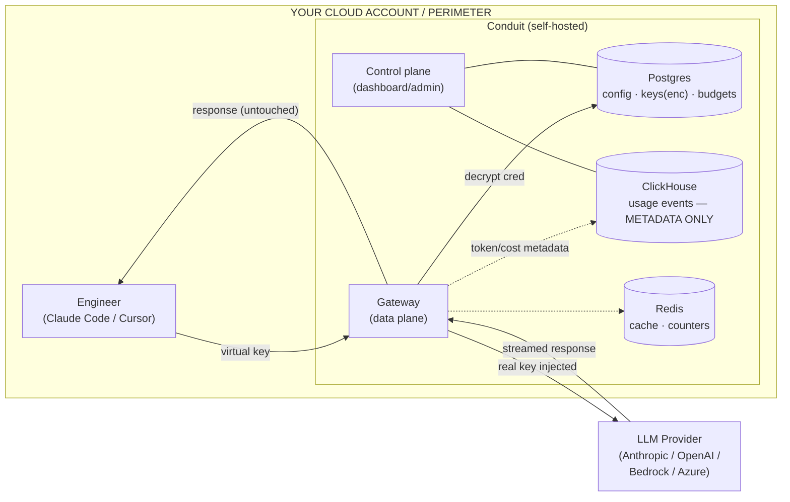

# Conduit — Security & Architecture Whitepaper

*For the security, GRC, and procurement teams evaluating Conduit. This document is
meant to answer the questions a regulated security review asks — up front, before
you have to ask them. Last updated: 2026-06.*

> **One-sentence summary:** Conduit is a self-hosted AI gateway that runs **entirely
> inside your own cloud account**. Your code, prompts, provider keys, and traffic
> never leave your perimeter and never reach the vendor. We sell you the software,
> support it, and ship signed, SBOM-attested releases — we do **not** host your data.

---

## 1. Deployment model — this is not SaaS

Conduit is delivered as container images you run in **your** environment (VPC, K8s
cluster, or a single VM). There is **no vendor-operated component in the request
path**, and **no phone-home**:

- The data plane (gateway), the control plane (dashboard/admin API), and all three
  datastores (Postgres, ClickHouse, Redis) run inside your account.
- The only outbound network calls Conduit makes are to **the LLM provider
  endpoints you configure** (e.g. `api.anthropic.com`, your Bedrock/Azure
  endpoint) and an **optional** alert webhook **you** set. Nothing is sent to the
  vendor.
- Conduit can run **fully air-gapped** from the vendor. There is no license-call,
  telemetry beacon, or update check that contacts us. (Updates are pulled by you,
  on your schedule, from signed images — see §7.)

If your "perimeter" is an AWS VPC, Conduit deploys there (ECS task / EKS pod /
sidecar). Same trust model, your infrastructure.

## 2. Data-flow diagram

**The vendor (Conduit) appears nowhere in this diagram.** Traffic flows
engineer → Conduit (in your account) → provider, and back.

## 3. What is and isn't stored

| Data | Stored? | Where | Notes |
|---|---|---|---|
| Prompt bodies | **No** | — | Never persisted. Inspected in memory, then discarded. |
| Completion bodies | **No** | — | Never persisted (except the optional exact-match cache, which stores a 2xx response body in Redis keyed to an identical request, TTL-bound, and which you can disable). |
| Provider API keys | Yes (encrypted) | Postgres | AES-256-GCM sealed; see §4. |
| Usage metadata | Yes | ClickHouse | Who/when/model/tokens/cost/status/latency — **metadata only**. |
| Governance findings | Yes (category only) | ClickHouse | The detected **category** (e.g. `aws_credentials`), **never the matched secret value**. |
| Virtual keys | Yes (hashed) | Postgres | SHA-256 of the secret; the plaintext key is shown once and never stored. |

**Privacy invariant:** Conduit records metadata about requests, never their
content. The governance scanner (§5) is explicitly designed so the matched
sensitive value is *never* written to any store or log — only its category.

## 4. Cryptography & secret handling

- **Provider credentials** are sealed at rest with **AES-256-GCM** (authenticated
  encryption) using a `MASTER_ENCRYPTION_KEY` you supply (32-byte, base64). The
  placeholder key is rejected at boot. Ciphertext is `iv:tag:ciphertext`; each
  encryption uses a fresh random IV; tampering fails the GCM auth tag (unit-tested).
- **Virtual keys** are stored only as SHA-256 hashes. The raw `vk_live_…` is shown
  once at creation and never persisted.
- The master key lives in your secret manager / environment, never in the database
  or images.
- Provider keys are decrypted **in memory, on the request path only**, injected
  into the upstream call, and never logged.

## 5. Data-governance (egress control)

Before a request can leave your perimeter for a provider, Conduit runs a
**pure, in-memory scan** on the request body:

- **T1 (universal secrets)** — high-confidence structured patterns: API keys,
  tokens, private-key blocks, credential assignments.
- **T2-lite (per-org entity allowlist)** — operator-pasted strings via
  `GOVERNANCE_ENTITIES` (customer names, internal codenames, deal codes).
  Whole-word, case-insensitive. Flagged as the `org_entity` category.
- Two actions: **alert** (record the category and forward) or **block** (reject
  with HTTP 451 before the request reaches the provider).
- A **per-category promote-to-block** feedback loop: run in alert, observe the
  false-positive rate per category on the dashboard, then enforce
  high-confidence categories one at a time (`GOVERNANCE_BLOCK_CATEGORIES`).
- **Only the category is recorded — never the value.** This holds for both T1
  secrets AND T2-lite entities; both are covered by explicit privacy tests
  asserting the matched string (and its case-folded form) never appears in
  `usage_events` or hit records.

The scan is synchronous and sub-millisecond; it is the only added latency on the
hot path, and it is opt-in (`GOVERNANCE_ENABLED=on|off`, default on).

## 6. Authentication & failure modes

- **Virtual-key auth fails CLOSED:** if the identity backend (Postgres) is
  unavailable, requests are rejected (503) rather than passed through unauthenticated.
- **Known budget overages fail CLOSED** (402). Other control-plane degradations
  follow a configurable `FAIL_MODE` (open|closed) so you choose availability vs.
  strictness for *your* risk posture.
- The admin API and the gateway reload endpoint are guarded by `ADMIN_TOKEN`.
- The dashboard UI is gated by a password (`DASHBOARD_PASSWORD`); the cookie holds
  a salted SHA-256 token, never the password.
- The prompt/completion bodies are never written to logs — logs are metadata only.

## 7. Supply chain & release integrity

- **Signed images:** release images are signed with **Sigstore cosign** (keyless /
  OIDC); you can verify provenance before deploying (`cosign verify …`).
- **SBOM:** every release ships a **CycloneDX/SPDX SBOM** (generated with Syft), so
  your team can inventory and scan dependencies. Generate one yourself any time
  with `scripts/sbom.sh`.
- **Vulnerability scanning:** images are scanned (Grype/Trivy) in CI.
- **Lean dependency surface:** the gateway (hot path) is deliberately
  zero-heavy-dependency — ClickHouse and cache use plain `fetch`/`ioredis`, not a
  driver stack — which shrinks the attack surface on the component that sees your
  traffic.
- **CVE-patching commitment (design-partner / commercial):** we monitor
  dependencies for advisories and ship patched releases for High/Critical CVEs
  affecting Conduit within a committed window (defined in the support agreement).

## 8. Tenancy & data isolation

Every record carries an `org_id` tenant key, even in single-tenant on-prem
deployments, so multi-team isolation is enforced at the data layer from day one.

## 9. Testing & change control

- **72 automated tests** (unit + live-system), run on every PR and push via CI
  (`.github/workflows/ci.yml`): typecheck, crypto round-trips, governance
  privacy invariant, AWS SigV4 verified against the published AWS test vector,
  auth/budget/rate-limit/cache behavior end-to-end.
- Branch flow: feature → `dev` → `master`; CI must pass before merge.

## 10. What Conduit is NOT (scope honesty)

- **Not a SaaS.** We never see your data (§1).
- **Not self-hosted inference.** Conduit proxies frontier providers; it does not
  run models. (Your model choice and contract with the provider are unchanged.)
- **Not a model-quality modifier.** Transparent proxy: the request body is never
  altered except where a provider's own API requires it (Bedrock body shaping);
  there is no silent model downgrade — a disallowed model is a clear 403.
- **No prompt/completion retention** (§3). Any future content-retaining feature
  would be explicit, per-policy, and opt-in.
- **Not a prompt rewriter / context optimizer.** Conduit does not trim,
  summarize, dedupe, or otherwise modify the prompt body before forwarding —
  doing so would break Anthropic's prefix cache (a byte-identical prefix is
  required for cache hits) and violate the byte-transparent promise that lets
  your security team approve us. The dashboard's **Context-rot panel**
  (`/api/usage` → `contextRot`) observes the cost-and-error curve by
  input-token size and tells you *where* you're paying for rot; the mitigation
  belongs in the client or agent (prompt caching, conversation compaction,
  task-aware trimming), not the gateway.

## 11. Compliance posture — what we DO and DON'T claim

We try to be precise here because vague compliance language is how vendors lose
trust during security review. As of this writing Conduit is **solo-built,
pre-revenue, and pre-formal-audit**. The honest read:

**What is true today:**

- Conduit is **on-prem software you run inside your own perimeter** (§1). Most
  compliance properties (SOC 2 control coverage, HIPAA controls, ISO 27001
  control coverage, data residency, BAAs with hyperscalers) are properties of
  *your environment* running Conduit — they're inherited from your cloud
  account, your secret manager, your identity provider, your network controls.
- The software is **designed to help you meet your own SOC 2 / HIPAA / ISO /
  RBI / DPDP / GDPR obligations**: prompt/completion bodies are never stored,
  provider keys are AES-256-GCM-sealed, every request is recorded as a
  metadata-only audit row exportable as RFC-4180 CSV or JSON (§3, §4, §5).
- Release supply-chain controls are in place: container images are signed via
  **Sigstore cosign (keyless OIDC)** and a **CycloneDX SBOM** ships as a
  signed attestation per release (§7).

**What we DO NOT claim today (and will not, until it's true):**

- **No SOC 2 Type II certificate**, no SOC 2 Type I, no Trust Services Criteria
  attestation. (On the roadmap once design partners + revenue make a formal
  audit make sense.)
- **No HIPAA BAA from Conduit as a vendor.** Because Conduit runs in *your*
  account and never receives PHI on our side, the BAA you need is with your
  cloud provider (AWS / Azure / GCP), not with us. We will support your
  internal documentation of the control split.
- **No ISO 27001, no PCI-DSS, no FedRAMP, no IRAP, no StateRAMP** certifications.
- **No third-party penetration test report** of the current release. (The code
  is open to your security team's review under pilot; an independent pentest is
  on the roadmap pre-GA.)

**What we WILL provide to your security review, free of charge:**

- This whitepaper + the data-flow diagram (§2) in your preferred format.
- A completed **CAIQ-lite / SIG-lite questionnaire**.
- The signed image manifests + the CycloneDX SBOM for the exact release you'll
  run.
- A vulnerability-disclosure commitment (§12) and a CVE-patching SLA on the
  versions you're running for the pilot window.
- Direct engineering access for clarifying questions during review.

If a control or document we don't yet have is a hard gate for your review, tell
us — we'll either show you the closest equivalent or say so honestly.

## 12. Coordinated vulnerability disclosure

Report security issues to **security@<your-domain>** (PGP key on request). We
acknowledge within 2 business days and coordinate disclosure with you.

---

*This document is provided to support your security review. A completed
CAIQ-lite / SIG-lite questionnaire and a data-flow diagram in your preferred
format are available on request. SOC 2 Type II is on the roadmap (no audit has
been started yet) — until then we will support your audit with the artifacts
above, the signed images + SBOM for the release you'll run, and direct
engineering access. We will not call ourselves "SOC 2 compliant" or
"HIPAA-compliant" before the corresponding artifact actually exists.*
